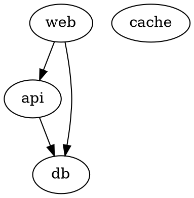

# `dot` diagrams

Graphviz, for a graph whose layout you need to control. The engine is `dot` unless the source sets `layout=` (`neato`, `circo`, `fdp`…).

## Fit and readability

- Prefer `rankdir=LR` for long chains. A tall diagram is capped at min(50vh, 440 px) behind a fade and a "Show full diagram" control, and the pane is often only 480–700 px wide.
- Keep to about 15 nodes. Past that, split the graph or group related nodes into `subgraph cluster_<name> { label="…" … }`.
- Keep labels short, a few words each. Put the explanation in the question's prose.

## Anchors

A comment names a node, edge or cluster by its `id` attribute, then by node name, or by `a -> b` for an edge. Use meaningful node names (`api`, `queue`) and give an `id` only when the name isn't one.

Ids shaped like `node1`, `edge2`, `clust3` or `graph4` can't be told from the ones Graphviz generates, so anchors ignore them and fall back to the node name.

## Preset marks

Put `class=recommended`, `class=risk` or `class=muted` on a node, edge or cluster:

A mark recolours only what still has the page's colours, so a colour you set on the same element wins.

## Theme override

Any colour attribute overrides the theme: `color`, `fillcolor`, `fontcolor`, `bgcolor`, `pencolor`, `labelfontcolor`, `colorscheme`, or a `` in an HTML label. An overridden graph stops following the theme, and if its text would be unreadable on dark, it falls back to the light backdrop. Use a preset mark to highlight.
