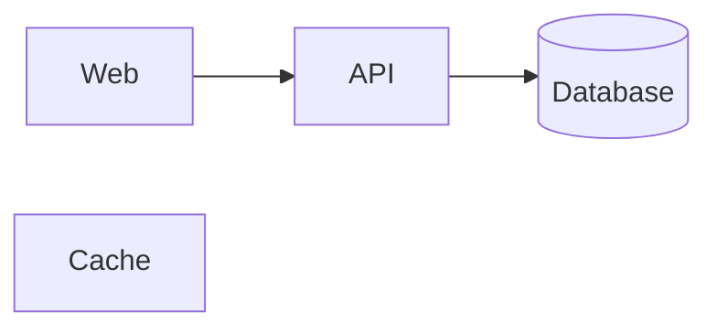
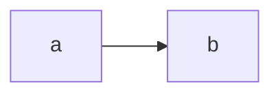

# `mermaid` diagrams

Mermaid 12 with the `neo` look. Flowcharts, state, class and ER diagrams lay out with ELK, and every other type uses its own default layout.

## Fit and readability

- Prefer `LR` for long chains. A tall diagram is capped at min(50vh, 440 px) behind a fade and a "Show full diagram" control, and the pane is often only 480–700 px wide.
- Keep to about 15 nodes. Past that, split the diagram or group related nodes into `subgraph`s.
- Keep labels short, a few words each. Put the explanation in the question's prose.

## Anchors

A comment comes back naming what was clicked in your terms, such as `node api` or `edge api → db`. Where the type lets you write ids, use meaningful ones (`api`, `queue`), because those ids are the anchor terms. Diagram types without ids are named by label, by position in the source, or by a neighbouring element.

Some spots can't be clicked, such as radar axis lines and a horizontal XY-chart bar covered by another. Comments there fall back to the nearest text and position.

## Preset marks

`recommended`, `risk` and `muted` are predefined classes:

In flowcharts, state and class diagrams they are real `classDef`s, so they survive an override that sets your own `themeCSS`. In other types that take `:::class`, such as mindmaps, they come from the page's `themeCSS`, and your own `themeCSS` replaces them. Defining a `classDef` with one of these names replaces that mark.

## Theme override

A `%%{init: {…}}%%` directive or a frontmatter `config:` merges over the page's settings and overrides the theme:

An overridden diagram stops following the theme, and if its text would be unreadable on dark, it falls back to the light backdrop.

`style` lines and `classDef … fill:` don't count as an override. Their colours stay fixed in both themes, with no light backdrop to rescue them, so use a preset mark instead.
