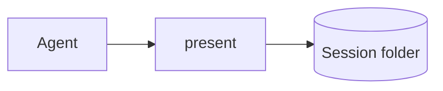

# The round file

A round file is the Markdown you hand to `present`: the round exactly as grilling would print it, plus optional fences. `present` checks it strictly and reports every problem at once, so write it, run `present`, and fix what it prints.

## Layout

In this order:

1. An optional `# Round title`: the first non-blank line, 60 characters at most.
2. An optional `design-tree` fence holding the whole design tree (see below).
3. The questions.

Nothing else comes before Q1: no intro prose, no other headings.

## Questions

A question starts at its header and runs to the next header:

```
❓ **Q<n>** - **<title>**: <body…>
```

- ❓ and ➡️ work with or without U+FE0F. The dash may be `-`, `–` or `—`. The colon may be missing or sit inside the bold.
- Numbers are unique and increase through the round. They may start anywhere, and carry on across rounds: after a round ending at Q6, open the next at Q7.
- `---` separators between questions are ignored.
- The header is its own paragraph, outside any list or quote.

Each question's parts come in this order, and only ➡️ is required:

1. **Prose**: GFM. Raw HTML shows as literal text. Use **bold** in place of headings.
2. **Illustrations**: fences at the top level of the question (see below).
3. **Options**: `- **A** - label`, one line each, letters A, B, C… with no gaps. Only the list right before ➡️ counts as the options.
4. **➡️ recommendation**: its own paragraph, running to the end of the question. When it opens with `**B**` it points at option B; otherwise it is free text.

### Mockups

A mockup is an `html` fence indented under its option, one per option. It takes no `id`; `tailwind=false` is its only key. The page shows the mockups side by side as cards keyed by letter, highlights the one the recommendation points at, and picks an option when its card is clicked. Comments on a mockup come back as `mockup B → …`.

````
- **A** - Tabs

  ```html
  <nav data-anchor="tabs">…</nav>
  ```

- **B** - Drawer
````

## Illustrations

Every fence in a question is an illustration; an indented code block stays prose. The info string is the language, then `key=value` attributes:

````
```mermaid id=flow title="Request flow"
````

- `id` is required, unique in the round, and matches `[a-z0-9][a-z0-9-]*`.
- `title` is optional.
- Keys are lower camelCase and given once. A value is bare or double-quoted, with `\"` and `\\` escapes.

| fence language | block | keys |
|---|---|---|
| `mermaid` | diagram (Mermaid) | `id`, `title` |
| `dot` | diagram (Graphviz) | `id`, `title` |
| `vega-lite` | chart (JSON only) | `id`, `title` |
| `table` | table (exactly one GFM table) | `id`, `title` |
| `diff` | code (unified diff) | `id`, `title` |
| `html` | raw HTML | `id`, `title`, `tailwind` (only `false`) |
| any other language | code in that language | `id`, `title`, `file`, `startLine`, `highlight` |
| `code` | code in a language the table reserves | as above, plus `lang` |

- `startLine` is a positive whole number.
- `highlight` takes lines and ranges like `3,5-7`, in the file's own line numbers when `startLine` is set, and must stay inside the code.
- An unknown code language falls back to plain text. `present` still shows the round and prints a note to stderr, in the rejection format with the message starting `note:`.
- To show a fence inside a source, wrap it in a longer outer fence or in `~~~`.
- In one `html` illustration or mockup, each `data-anchor` name is unique.

## The design tree

An optional `design-tree` fence before Q1 holds the whole tree as one nested GFM task list. Each round carries the whole tree, which replaces the previous one; without the fence the round page hides the tree column.

- `[x]` marks a settled branch, optionally followed by `: gist`.
- `[ ]` marks an open one.
- A bare `Q<n>` links to that question, which must be in this round or an earlier round of the grilling session. A link to an earlier round's question opens that round, read-only, at the question.
- A branch is one line; nest sub-branches as a list.

````
```design-tree
- [x] Storage: session folder in $TMPDIR
  - [ ] Retention Q2
- [ ] Runtime Q1
```
````

## Rejections

`present` prints every rejection to stderr, one per line, then exits 1 and shows nothing:

```
round.md:LINE · Q2 · illustration "flow" (mermaid): <message>
```

Question-level errors drop the illustration part; round-level errors drop the question too. A mockup shows as `mockup A (html)`. Fix every line and run `present` again.

`present` rejects:

- **Round**: no question at all; content before Q1; a `# title` that isn't the first line, is empty, or runs over 60 characters.
- **Headers**: a malformed header; a header inside a list or quote; a duplicate number; a number that doesn't increase.
- **Parts**: a missing, empty or second ➡️ recommendation; a ➡️ folded into the paragraph above it (put a blank line before it); parts out of order; a heading anywhere in a question; a fence inside a list or quote.
- **Options**: gaps in the letters (or a list not starting at A); an item not written `- **A** - label`; an option running past one line; anything but an html mockup indented under an option; a second mockup under one option; a recommendation pointing at a missing option; an html fence right after an option but not indented under it (with the hint "indent it under option B").
- **Illustrations**: a fence with no language; a `design-tree` fence inside a question; a missing, malformed or duplicate `id`; an unknown key, a key that isn't lower camelCase, a key given twice, or a token that isn't `key=value`; a quoted value with no closing quote, a quote that doesn't wrap the whole value, or no space after it; an empty `title` or `file`; a bad `tailwind`, `startLine` or `highlight` value, or a `highlight` outside the code; a `code` fence without `lang=`, or a `lang` that isn't a language name; a duplicate `data-anchor` in one html illustration or mockup.
- **Mockups**: an `id`; any key but `tailwind`.
- **Design tree**: anything but one task list in the fence; a branch without `[ ]` or `[x]`, with no name, or running past one line; a `Q<n>` that no round of the grilling session has had; a second design-tree fence.
- **Drawing**: any block that fails to draw (it throws or comes out empty, like a `diff` with no files). Where `present` recognises the failure, its message says how to fix it.

## Worked example

`````
# Storage choices

```design-tree
- [x] Channel: browser
- [ ] Storage
  - [ ] Location Q1
  - [ ] Runtime Q2
```

❓ **Q1** - **Where are rounds saved?**: Rounds need a home for the session, and nothing should outlive it.



- **A** - Session folder in `$TMPDIR`
- **B** - The repository

➡️ **A** because it is deleted with the session.

---

❓ **Q2** - **Which runtime?**: Cold start matters more than throughput.

```table id=runtimes title="Runtime comparison"
| runtime | cold start | bundled |
|---|---|---|
| Node | **40 ms** | yes |
| Bun | 60 ms | no |
```

- **A** - Node
- **B** - Bun

➡️ **A**, since it ships with every agent host.

---

❓ **Q3** - **Where does Submit live?**: The page is narrow.

- **A** - Sticky bar

  ```html
  <div data-anchor="bar" class="flex justify-end p-2"><button data-anchor="submit">Submit round</button></div>
  ```

- **B** - Review step only

  ```html
  <div data-anchor="review" class="p-2"><button data-anchor="submit">Submit round</button></div>
  ```

➡️ **A** so it is always one click away.
`````
