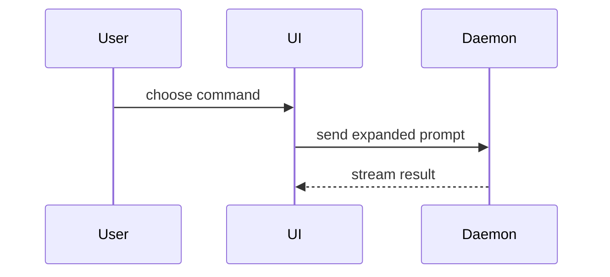

A pull request carries one concern, targets the base branch directly, and is never stacked on another PR. Its body is a briefing a reviewer reads in under a minute, from a phone. A prototype PR follows [Prototype PRs](#prototype-prs) instead of the steps below.

The base branch is the one the brief names, else the repo's default branch. One-way doors live in `docs/agents/autonomy.md` under `## One-way doors` (its `### Paths` and `### Changes`). `docs/agents/verification.md` is the one full statement of the verification ledger: the ledger comment, the tier label and the five tiers.

## Steps

1. **One concern.** Read the diff against the base. When it holds two concerns that land separately, split it into PRs that each branch from the base. A PR that needs another PR's change first waits until that one merges.
2. **Commits.** Regroup your branch's commits in dependency order with the **make-pr-easy-to-review** skill's History Cleanup, before the first push. There is no PR yet, so list the commits with `git log <base>..HEAD`; the branch is yours, so the rewrite needs no ask. Each commit message is a conventional commit.
3. **Title.** A conventional commit: `type(scope): subject`, with `feat`, `fix`, `docs`, `refactor`, `test`, `build`, `chore` or `perf` as the type, the changed area as the scope, and a short imperative subject with no trailing period.
4. **Summary.** When the change rewires control flow (calls added, removed or moved), generate the call tree with calldiff, then sanity-check it; see [Summary](#summary). Otherwise pick the smallest visual from the menu there.
5. **Scope.** One line: what this PR deliberately leaves out, so the reviewer does not review for it.
6. **Evidence.** Name the test that was red before the change and is green after it, with both runs' output. When the change shows on a surface (a UI, a CLI's output), capture before and after; see [Evidence](#evidence).
7. **Merge danger.** A PR that touches a one-way door path or makes a one-way door change is one-way: label it `door:one-way`, and it waits for the chef's merge at every rung. Run the **blast-radius** skill on the diff and keep its one fact the change is safe because of, with how far it was proven. Write the `Blast radius:` line as the first mention of blast radius in the body.
8. **Verdict and decision log.** Put the verifier's verdict at the head SHA in the body, with a link to its ledger comment, and apply its tier as the label per `docs/agents/verification.md`. Link the decision log the **show-me-your-work** skill kept for this work (start one if there is none): the committed file, or, when the log stays local, a PR comment holding it in a `tsv` block, posted right after opening and linked with `gh pr edit`. No verdict yet means `Verdict: pending` and no tier label; update both when the verdict lands.
9. **Open it.** Fill the [template](#template) and open the PR with media attached:

   ```bash
   gh pr create --base <base> --title "<type(scope): subject>" --body-file body.md \
     --attach './before.png#<what the before shows>' --attach './after.png#<what the after shows>' \
     --label <tier> [--label door:one-way]
   ```

   `--attach` needs gh 2.99 or later (`gh --version`). It uploads each file and rewrites a body reference such as `` to the uploaded asset, so put the references where they belong in Evidence. Use `gh pr edit <n> --attach ...` to add media later. If a label is missing in the repo, create it with `gh label create <name>` and say so in your report.

   In a cloud thread, where `gh pr create` fails with `This GraphQL query is not enabled for this session`, follow [Cloud threads](#cloud-threads) instead.
10. **After new commits.** Every push moves the head SHA, so the verdict goes stale unless the patch-id is unchanged (`docs/agents/verification.md`): set the Verdict line back to `pending`, remove the tier label, and re-run the verifier.

## Cloud threads

In a Claude Code cloud session, GitHub's proxy rejects most GraphQL, so `gh pr create`, `gh pr edit`, `gh pr view` and `gh pr comment` fail there, and a token set on the environment doesn't change that. Open and maintain the PR through REST instead; `docs/agents/issue-tracker.md` lists the full set under Cloud threads.

- **Create**: `gh api repos/<owner>/<repo>/pulls --method POST -f title="<type(scope): subject>" -f head=<branch> -f base=<base> -F body=@body.md --jq .number`.
- **Labels**: `gh api repos/<owner>/<repo>/issues/<n>/labels --method POST -f 'labels[]=<tier>' [-f 'labels[]=door:one-way']`; remove one with `--method DELETE` on `.../labels/<label>`. Create a missing label with `gh api repos/<owner>/<repo>/labels --method POST -f name=<label> -f color=<hex>`.
- **Edit**: `gh api repos/<owner>/<repo>/pulls/<n> --method PATCH -F body=@body.md` for the verdict line or the decision-log link, `-f title="..."` for the title. Close a prototype PR with `-f state=closed`.
- **Comments**: post with `gh api repos/<owner>/<repo>/issues/<n>/comments --method POST -F body=@comment.md`, and read them with `gh api repos/<owner>/<repo>/issues/<n>/comments --paginate`.

There is no `--attach` in a cloud thread. Put text evidence (test output, a CLI's before and after) inline in Evidence as fenced blocks. For a visual change, capture what you can as text and write `Media: not attached (cloud thread)` under Evidence, so a local thread or the chef can add it later with `gh pr edit <n> --attach`. A prototype PR is nothing without its screencasts, so leave opening one to a local thread. A cloud thread that resumes on the chef's pick reads the PR's comments, comments on the ticket and closes both through the same REST forms.

## Template

```markdown
## Summary

<call tree, diagram, diff-sketch, or tree>

**Scope:** <what this PR leaves out>

## Evidence

**Test:** `<test name>` — red before, green after.

- **Before:** <screenshot/screencast/failing test output>
  **After:** <screenshot/screencast/passing test output>

## Merge Danger

**Door:** <one-way or two-way>

Blast radius: <high|medium|low>

**Safe because:** <the one fact> (<proof level and where the proof is>)

<optional: the one-way door path or change, and the risks the blast-radius pass confirmed>

## Verification

Verdict: <pass|fail|pending> at <short head SHA> (<tier>) — <link to the ledger comment>

Decision log: <link>

Closes #<ticket>
Fix-forward: #<the merged PR this repairs>
```

The `Fix-forward:` line goes only on a fix-forward PR, one that repairs an earlier merged PR, and names that PR alone.

## Sections

Skip all preambles and keep prose brief. Use the user's domain language from the project's glossary. Find where the glossary and ADRs live through the kitchen config index, `docs/agents/AGENTS.md`: open the document its table lists for the domain and follow it. Without one, look for `GLOSSARY.md` at the repo root and ADRs in `docs/adr/`.

### Summary

Pick the smallest view that makes the key point clear.

#### Call trees from calldiff

When control flow changes, generate the call-tree diff with [calldiff](https://github.com/tanishqkancharla/calldiff) instead of drawing it:

```bash
npx calldiff@latest diff <base> HEAD                      # infers changed entrypoints
npx calldiff@latest diff <base> HEAD -e <Class.method>    # force an entrypoint
npx calldiff@latest diff <base> HEAD <path>               # limit to paths
```

Piped output is colourless ASCII with `+` and `-` lines, followed by suggested commands. Paste the tree in a `diff` block, trimmed to the changed branches and their parents, and drop the suggestions. calldiff reads syntax only, so calls through dynamic dispatch never appear: callbacks, interface or virtual methods, event emitters, dependency injection, string-keyed handlers. Sanity-check every tree against the diff before you paste it. Add a call it missed by hand, and when a missing call is the change itself, or calldiff can't parse the language, draw the flow as Mermaid instead.

#### The menu

- Show logic or an algorithm as pseudocode:

```text
on(save)
  if content is unchanged
    return cached result
  write new content
  return fresh result
```

- Show runtime control flow as a call tree:

```text
submitForm
  createSession
    persistPrompt
    launchAgent
  navigateToSession
```

- Show UI structure as a component tree, including state and module boundaries that matter:

```text
<SessionPage> (apps/example/src/routes/session.tsx)
  useSessionEvents()
  <SessionToolbar>
    <RunSkillButton> (packages/ui)
```

- Show file responsibility or a broad refactor as a shallow file tree:

```text
src/
├── commands/       # parses user actions
├── sessions/       # owns session state
└── transport/      # sends API requests
```

- Show component interaction, control flow, or data flow with Mermaid:



- Use `diff` when the point is what changes and the surrounding shape already exists. Match the diff shape to the topic.

For a component change:

```diff
 <SessionPage>
   useSessionEvents()
   <SessionToolbar>
+    <RunSkillButton />
   <SessionTimeline>
+    <SkillResultCard />
```

For a file-layout change:

```diff
 src/
 ├── commands/
+│   └── show-me.ts       # expands the slash command
 ├── sessions/
-└── transport.ts
+└── transport/
+    ├── client.ts
+    └── stream.ts
```

For a state or control-flow change:

```diff
 on(save)
-  write content
+  if content is unchanged
+    return cached result
+  write new content
+  invalidate cache
```

- Show the whole block when most of it is new, when omitted context would hide ownership or order, or when the user needs a copyable target shape:

```ts
function expandSkill(command: string): string {
  const skillName = command.slice(1);
  return `use the ${skillName} skill`;
}
```

#### Guidance

Place each visual next to the short text it supports. Keep only the calls, files, props, states, and boundaries needed to answer the user's current question or the options to resolve the current discussion point.

You may use one of these, you may use several, it is unlikely you will use all of them. Use your judgement and don't overwhelm the user.

### Evidence

Concrete evidence that the change works. Show a before and after.

Screenshots and screencasts are S-tier when the change is visual. Drive the app with the **control-ui** skill (Playwright: `page.screenshot()` for a still, a context with `recordVideo` for a screencast) or the **control-cli** skill for a terminal. Capture the before from the base commit, checked out in its own worktree (`git worktree add <dir> <base>`), and the after from the head. Keep each image under 10 MB and each video under 10 MB (100 MB on a paid GitHub plan): trim the screencast to the change, and shrink the viewport or frame rate before you cut content.

Execution-based evidence is A-tier. Test results, console output. Show the exact test that now fails and passes, using pseudocode.

### Merge Danger

Describe whether it's a one-way or two-way door. You can walk back through two-way doors, but not one-way doors. A PR that is cheap to roll back is lower risk. Changes that involve destructive actions or hard-to-reverse decisions are one-way doors.

The blast radius is the potential impact or scope of the changes introduced by this PR. Consider all possibilities. Examples are layout shift, breakages for consumers, mobile responsiveness, etc.

## Prototype PRs

A prototype PR asks the chef to pick between variants of a UI. Nothing in it merges.

1. **Open it as a draft** from the prototype branch: titled `prototype: <the question>`, labelled `prototype`, with a body that states the question, lists the variants by letter with one line each, and asks the chef to reply with a letter.

   ```bash
   gh pr create --draft --base <base> --title "prototype: <the question>" --label prototype \
     --body-file body.md --attach ./variant-a.webm --attach ./variant-b.webm --attach ./variant-c.webm
   ```

2. **One screencast per variant**, recorded with the **control-ui** skill (Playwright `recordVideo`, one run per `?variant=`), under the video limit in [Evidence](#evidence). Reference each one under its variant's line in the body.
3. **Don't wait for the pick.** The thread that opens the PR posts its URL, parks the pick and stops. The chef's pick, a comment on the PR (`gh pr view <n> --comments`), resumes as a new thread, started by the Projects coordinator on its next drain or by the chef, and that thread runs step 4. A reply that picks no variant, or asks for changes, gets a new round of variants on the same PR from that thread.
4. **Record the decision and close it unmerged.** The thread the pick started posts the decision (the variant picked, the chef's reasons in their words, the branch and its head SHA as the reference spec for the build) as a comment on the ticket, then close the PR with the same text:

   ```bash
   gh issue comment <ticket> --body-file decision.md
   gh pr close <n> --comment "$(cat decision.md)"
   ```

   When the ticket is a prototype ticket (labelled `prototype`), close it too with `gh issue close <ticket>`, which unblocks the tickets that wait on its answer.

   Keep the branch: the build uses it as the reference spec and rebuilds the winning variant properly, so no prototype shortcut lands.
